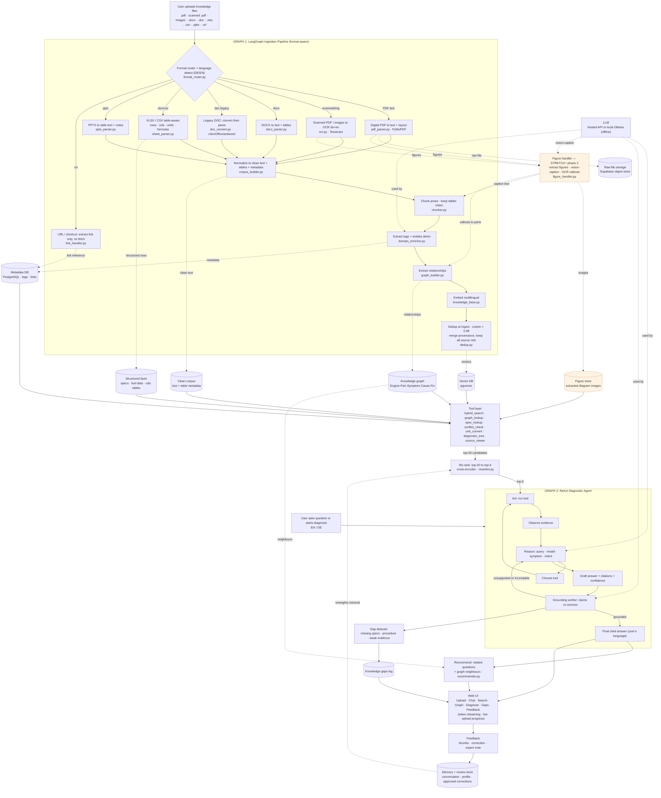

# TwoStrokeGPT — System Architecture (format-aware + enhanced retrieval)

An AI-powered two-stroke knowledge platform for Hirth Engines. Knowledge comes from **user-uploaded documents in any format** (no external scraping in this phase). A **format router** sends each upload to a dedicated handler, then everything converges into normalize → chunk → enrich → embed → dedup. A **ReAct diagnostic agent** retrieves (hybrid + cross-encoder re-rank), answers with cited, self-checked responses in the user's language (EN/DE), and recommends related questions.

## Figure & diagram intelligence (stretch / phase 2)

Handles the visual content text/OCR alone can't — exploded parts diagrams, schematics, and charts in manuals, the thesis, and the simulation report. Added as an end-of-pipeline branch so it's clearly optional, not MVP.

1. **Extract figures** from PDFs (PyMuPDF) and store the image (`Figure store`).
2. **Vision-caption** each figure with a multimodal LLM → a searchable text description ("exploded view, crankcase assembly, callouts 1–18") that flows into the normal chunk → embed path.
3. **OCR callouts → parts** so a number like "14" links to its part name and into the Engine→Part graph.
4. **`source_viewer` returns the actual image** beside the cited answer.

Gets ~80% of the wow ("ask about a diagram, get an answer + the picture") without solving hard spatial reasoning. True "point at the exact bolt" QA is out of scope.

## Retrieval & UX enhancements (what's new in this version)

- **Re-ranking layer (`reranker.py`)** — retrieval returns top-20 candidates; a cross-encoder (e.g. `ms-marco-MiniLM-L6`) re-scores them against the exact query and passes the top-5 to the agent. Big precision gain for numeric/spec queries where "related" isn't good enough. Memory feedback reweights at this stage.
- **Recommendation (`recommender.py`)** — after each answer, suggests related follow-up questions (from retrieved content) and related parts/symptoms (from graph neighbours). This is an explicit challenge requirement, now covered.
- **Dedup at ingest (`dedup.py`)** — cosine > 0.98 means a duplicate (e.g. a spec copied between a manual and a spreadsheet). The duplicate vector is skipped, but **all source references are merged onto the kept chunk** — so provenance and `conflict_check` still see every source.
- **Streaming + progress (UI)** — answers stream token-by-token (after the grounding check passes); uploads show live pipeline progress (Parsing… Chunking… Embedding… N chunks indexed). Demo polish, low effort.
- **Document versioning (roadmap, phase 2)** — re-uploading the same filename prompts replace-or-new-version; replace deletes old vectors by `doc_id` and re-ingests, preventing stale-chunk conflicts. Designed-for, not built for the hackathon.

## How each format is handled (mapped to real sample files)

| Sample file | Type | Handler | Notes |
|---|---|---|---|
| `Diplomarbeit Auslegung und Optimierung.pdf`, `Simulation_Modelling.pdf` | Digital PDF | `pdf_parser.py` (PyMuPDF) | Section-aware chunking + heading/page metadata; German text. |
| `FAR33.49.pdf` | Regulatory PDF (EN) | `pdf_parser.py` | Clause-level chunks; cite by section number (e.g. "FAR 33.49"). |
| *(older scanned manuals)* | Scanned PDF / image | `ocr.py` (Tesseract de+en) | OCR to recover text; flag low-confidence pages for review. |
| `Berechnung Schallgeschwindigkeit im Auspuff.xlsx`, `Fuel_Kraftstoffe_Übersicht_Daten.xlsx` | Spreadsheet (calc/data) | `sheet_parser.py` | **Table-aware**: preserve rows/cols/units (and formulas). Rows written to the **Structured-facts store** so exact values are retrievable + citable. |
| `Mögliche Werkzeugradien.doc` | Legacy Word (.doc) | `doc_convert.py` | `.doc` ≠ `.docx`; convert via LibreOffice/antiword first, then parse. |
| *(modern Word)* | .docx | `docx_parser.py` | Extract text + tables. |
| *(decks)* | .pptx | `pptx_parser.py` | Slide text + speaker notes. |
| `HYDAC International.url` | Windows shortcut | `link_handler.py` | Not a document — extract the target URL, store as a **reference link** in metadata. No content fetch under current scope; flag for optional phase-2 ingestion. |

## Key design decisions driven by this data

- **Numbers must be grounded, never guessed.** This corpus is quantitative (speed of sound, fuel specs, tool radii, FAR test limits). `spec_lookup` reads the **Structured-facts store** and the grounding verifier rejects any numeric claim not tied to a source cell/clause.
- **Spreadsheets are first-class, not stretch.** Two of seven sample files are calculators/data tables — table-aware parsing is in the MVP.
- **German-first multilingual.** Most content is German; multilingual embeddings let an EN or DE query retrieve from either, with answers in the user's language and citations to the original.
- **Handle awkward formats gracefully.** Legacy `.doc` conversion and a clear `.url` policy are built in.

## How to read the graph

**Graph 1 — Ingestion:** format router → per-format handler → normalize → chunk (tables kept intact) → tag/entity extraction → relationship extraction → embed → dedup. Writes to six stores including a dedicated structured-facts store.

**Graph 2 — ReAct agent:** reason → choose tool → act → observe → loop; retrieval is hybrid then cross-encoder re-ranked (top-20 → top-5); draft → grounding verifier loops back if unsupported or emits a cited answer; the recommender adds related questions; weak evidence feeds the gap detector.

**Feedback + memory:** UI feedback → memory/review store → reweights re-ranking. Improves the system without retraining the base model.

**Deployment:** the LLM can be a hosted API or a local Ollama model for offline, data-sovereign operation.
