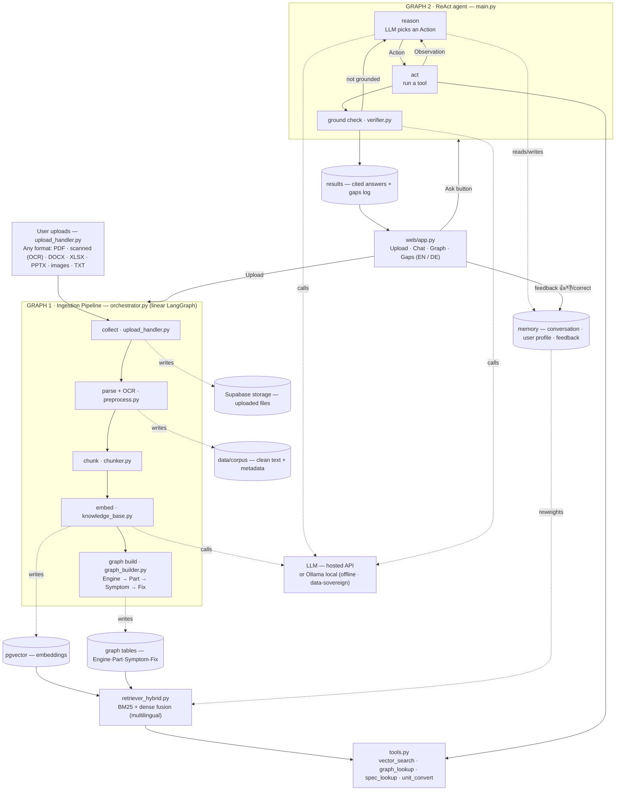

# TwoStrokeGPT — System Architecture

An AI-powered two-stroke knowledge platform for Hirth Engines. Knowledge comes from **user-uploaded documents in any format** (no external scraping in this phase). Two LangGraph graphs: a linear **ingestion pipeline** that turns uploads into a searchable knowledge base, and a **ReAct agent** that answers questions with cited, self-checked responses.

## How to read it

**Graph 1 · Ingestion Pipeline** — runs whenever a user uploads a document. Any format is collected, parsed (with OCR for scanned files), chunked, embedded into pgvector, and linked into the Engine→Part→Symptom→Fix knowledge graph.

**Graph 2 · ReAct agent** — answers questions. The LLM reasons, picks a tool (action), observes the result, and loops until ready; a ground-check verifies the draft is supported by sources before replying (corrective RAG), looping back if not.

**Data stores** — Supabase storage (raw files), the cleaned corpus, pgvector (embeddings), graph tables, a memory store (conversation, user profile, feedback), and results (cited answers + gap log).

**Retriever** — hybrid BM25 + dense fusion so exact terms (e.g. part numbers like `3503`) and semantic matches both work; multilingual so a German query matches English manual text.

**Feedback loop** — user feedback (votes / corrections) writes to memory, which reweights retrieval over time. The system improves without retraining the base model.

**Deployment note** — the LLM can be a hosted API or a local Ollama model for offline, data-sovereign operation (relevant for defense / heavy-fuel customers).
